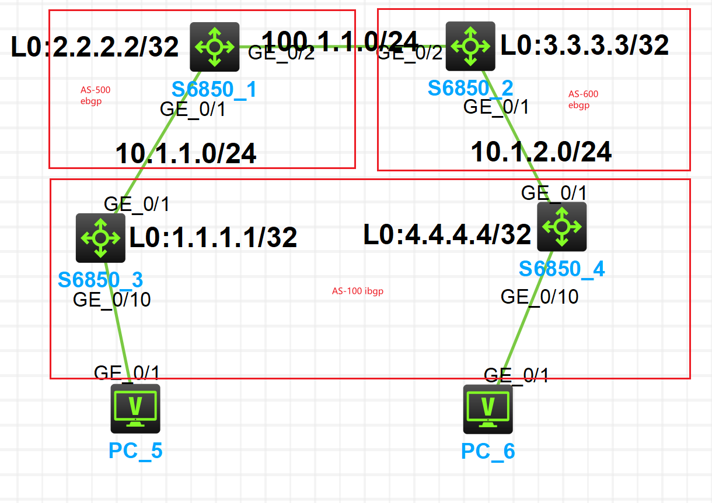

# VXLAN EVPN Lab on H3C S6850: eBGP Underlay + iBGP Overlay

## Introduction

This small lab demonstrates how to build a VXLAN EVPN fabric on four H3C S6850 switches in a Spine–Leaf topology using the **H3C Cloud Lab (HCL)** simulator.

The main use case is simple:

> **PC_5 on the left should be able to ping PC_6 on the right over a VXLAN tunnel.**

Instead of configuring classic VLANs and SVIs on the leaf switches, the design uses **VSI + VXLAN only** on the access side.  
The goals:

- Underlay: pure IP with eBGP.
- Overlay: BGP EVPN (AS 100) with VXLAN.
- Leaf switches do **not** carry customer VLANs in the underlay; they just map VXLAN VNIs to VSIs, which is more scalable for large fabrics.

The physical / logical topology is shown below:



- **Spine1 (S6850_1)** – Loopback `2.2.2.2/32`, AS **500**  
- **Spine2 (S6850_2)** – Loopback `3.3.3.3/32`, AS **600**  
- **Leaf1 (S6850_3)** – Loopback `1.1.1.1/32`, AS **100**  
- **Leaf2 (S6850_4)** – Loopback `4.4.4.4/32`, AS **100**

All four devices run Comware 7.

---

## Step 1 – Build the eBGP Underlay

The underlay is a simple **IP routed network with eBGP**.

- Leafs are in **AS 100**.
- Spine1 is in **AS 500**, Spine2 in **AS 600**.
- Point-to-point links:
  - Leaf1 ↔ Spine1: `10.1.1.0/24`
  - Spine1 ↔ Spine2: `100.1.1.0/24`
  - Leaf2 ↔ Spine2: `10.1.2.0/24`

Basic IP addressing and interface configuration are omitted here; you can derive them from the topology diagram and device configs.

### 1.1 Leaf1 BGP underlay configuration

Leaf1 (S6850_3) BGP configuration:


```text
bgp 100
 peer 2.2.2.2 as-number 100
 peer 2.2.2.2 connect-interface LoopBack0
 peer 10.1.1.2 as-number 500
 peer 10.1.1.2 ebgp-max-hop 255
 #
 address-family ipv4 unicast
  network 1.1.1.1 255.255.255.255
  network 10.1.1.0 255.255.255.0
  peer 2.2.2.2 enable
  peer 2.2.2.2 allow-as-loop 10
  peer 10.1.1.2 enable
  peer 10.1.1.2 allow-as-loop 10
#
````

Key points:

* `peer 10.1.1.2 as-number 500` – eBGP neighbor toward Spine1 on the physical link.
* `peer 2.2.2.2 as-number 100` – iBGP neighbor toward Spine1’s loopback (used later for EVPN).
* `network` statements advertise the loopback and the Leaf–Spine link.

The important knob is:

```text
peer 2.2.2.2 allow-as-loop 10
peer 10.1.1.2 allow-as-loop 10
```

`allow-as-loop` lets the router accept routes containing its own AS (AS 100) several times in the AS-PATH.
Because we run eBGP (100 ↔ 500/600) and iBGP (inside AS 100) over the same physical topology, this prevents valid routes from being wrongly dropped as “looped”.

### 1.2 Spine1 BGP underlay configuration

Spine1 (S6850_1):


```text
bgp 500
 peer 10.1.1.1 as-number 100
 peer 10.1.1.1 ebgp-max-hop 255
 peer 100.1.1.2 as-number 600
 peer 100.1.1.2 ebgp-max-hop 255
 #
 address-family ipv4 unicast
  network 1.1.1.1 255.255.255.255
  network 2.2.2.2 255.255.255.255
  network 3.3.3.3 255.255.255.255
  network 10.1.1.0 255.255.255.0
  network 100.1.1.0 255.255.255.0
  peer 10.1.1.1 enable
  peer 100.1.1.2 enable
#
```

Spine1 is in AS 500 and establishes:

* eBGP with Leaf1 (AS 100) on `10.1.1.1`.
* eBGP with Spine2 (AS 600) on `100.1.1.2`.

It advertises its own loopback, Spine2’s loopback and both point-to-point subnets.

Spine2 and Leaf2 follow the same pattern:

* Spine2 (AS 600) peers with Spine1 (AS 500) and Leaf2 (AS 100).
* Leaf2 (AS 100) peers with Spine2 (AS 600) and later runs EVPN over loopbacks.

### 1.3 Verifying the eBGP underlay

On **Spine1**:


You should see established IPv4 BGP peers with Leaf1 and Spine2.

On **Spine2**:


You should see established IPv4 BGP peers with Spine1 and Leaf2.

In addition, verify on each device that all loopbacks (`1.1.1.1`, `2.2.2.2`, `3.3.3.3`, `4.4.4.4`) are reachable in the routing table.

At this point the **IP underlay is fully converged** and ready to carry the overlay control plane (BGP EVPN) and VXLAN data plane.

---

## Step 2 – Create VPN Instance, VSI and Distributed Gateway on the Leafs

Next we build the overlay pieces on the leaf switches:

1. Create **VPN instance (VRF) `vpn1`**.
2. Create **VSI 100** and bind it to **VNI 100**.
3. Configure **VSI interfaces** as distributed gateways for the host subnet.

All of this is **identical on Leaf1 and Leaf2**.

### 2.1 VPN instance `vpn1`

Leaf1 VPN configuration:


```text
ip vpn-instance vpn1
 route-distinguisher 1:2
 vpn-target 2:2 import-extcommunity
 vpn-target 2:2 export-extcommunity
 #
 address-family ipv4
  vpn-target 2:2 import-extcommunity
  vpn-target 2:2 export-extcommunity
 #
 address-family evpn
  vpn-target 2:2 import-extcommunity
  vpn-target 2:2 export-extcommunity
#
```

* **VPN target (RT)** `2:2` is the same on both leafs. This is mandatory so that EVPN routes for `vpn1` are imported/exported between Leaf1 and Leaf2.
* **Route distinguisher (RD)** can be different per leaf. It only needs to be unique; it does not have to match.

**Summary:** RTs must match; RDs just need to be unique.

### 2.2 VSI 100 and VXLAN binding

Leaf1 VSI configuration:


VSI 100 is:

* associated with `vpn1`,
* bound to **VNI 100**,
* and configured for EVPN so that MAC/IP routes are advertised.

`Vsi-interface100` is specified as the gateway interface for this VSI.

So:

* **VSI 100** = “L2 service instance” for the hosts.
* **VNI 100** = VXLAN ID transporting that L2 domain across the fabric.

### 2.3 VSI interfaces: L3-VNI and distributed gateway

Leaf1 VSI interface configuration:


```text
interface Vsi-interface1
 ip binding vpn-instance vpn1
 l3-vni 1
#
interface Vsi-interface100
 ip binding vpn-instance vpn1
 ip address 192.168.1.254 255.255.255.0
 mac-address 0001-0001-0001
 distributed-gateway local
#
```

* **`Vsi-interface1`**

  * Bound to `vpn1` and configured with `l3-vni 1`.
  * Represents the **L3 VNI** for the VRF. In a larger design this is used for inter-subnet routing and EVPN Type-5 routes.
  * In this small lab we mainly prepare the fabric for scalable L3 services.

* **`Vsi-interface100`**

  * Bound to `vpn1` with IP `192.168.1.254/24`.
  * Acts as the **default gateway** for PCs in the 192.168.1.0/24 subnet.
  * `mac-address 0001-0001-0001` gives a stable virtual MAC.
  * `distributed-gateway local` turns it into a **distributed anycast gateway**: both leafs use the same IP/MAC, so each host uses its local leaf as first hop.

Configuration for these VSI interfaces is identical on Leaf1 and Leaf2.

### 2.4 PC-facing interfaces and VSI access

On the access ports for PC_5 and PC_6 we simply attach the port to VSI 100.
On Leaf1:


```text
interface GigabitEthernet1/0/10
 port link-mode route
 xconnect vsi 100
#
```

This connects the physical port directly into VSI 100 (other access methods like VLAN bridge mode are also possible).

Once the port is associated with VSI 100 and VNI 100, the leaf can:

* Learn the host’s MAC/IP in `vpn1`.
* Advertise that information as EVPN routes to the other leaf.

### 2.5 Quick verification from the VRF

We can verify basic local connectivity by pinging the PC from the leaf inside the VRF.

On Leaf1:


```text
ping -vpn-instance vpn1 192.168.1.10
```

If this ping succeeds, the PC is correctly attached to VSI 100 and the distributed gateway works.

At this point:

* `vpn1` is created on both leafs with matching RTs.
* VSI 100 is mapped to VNI 100.
* Anycast gateway `192.168.1.254/24` is active on both leafs.

---

## Step 3 – Build the EVPN Overlay and VXLAN Tunnels

Now we build the **EVPN iBGP overlay** on top of the underlay and VPN/VSI configuration.

* Leaf1 and Leaf2 peer (for EVPN) with the spines using their **loopback addresses** in **AS 100**.
* Spine1 and Spine2 run **`bgp 100 instance 1`** and act as **route reflectors** only. They do not hold VRFs for `vpn1`.

### 3.1 Enable EVPN on the leaf switches

On Leaf1 we extend the BGP configuration with `address-family l2vpn evpn`:


```text
bgp 100
 peer 2.2.2.2 as-number 100
 peer 2.2.2.2 connect-interface LoopBack0
 ...
 #
 address-family l2vpn evpn
  peer 2.2.2.2 enable
#
```

* EVPN uses the loopbacks `1.1.1.1` ↔ `2.2.2.2` as session endpoints.

On Leaf2 the configuration is symmetric with Spine2 (`peer 3.3.3.3 enable`).

### 3.2 Configure `bgp 100 instance 1` on the spines (Route Reflectors)

Spine1:


```text
bgp 100 instance 1
 peer 1.1.1.1 as-number 100
 peer 1.1.1.1 connect-interface LoopBack0
 peer 3.3.3.3 as-number 100
 peer 3.3.3.3 connect-interface LoopBack0
 #
 address-family l2vpn evpn
  undo policy vpn-target
  peer 1.1.1.1 enable
  peer 1.1.1.1 reflect-client
  peer 3.3.3.3 enable
#
```

Spine2:

```text
bgp 100 instance 1
 peer 4.4.4.4 as-number 100
 peer 4.4.4.4 connect-interface LoopBack0
 peer 2.2.2.2 as-number 100
 peer 2.2.2.2 connect-interface LoopBack0
 #
 address-family l2vpn evpn
  undo policy vpn-target
  peer 4.4.4.4 enable
  peer 4.4.4.4 reflect-client
  peer 2.2.2.2 enable
#
```

Highlights:


Two important points:

1. **`undo policy vpn-target`**
   By default, a spine could filter EVPN routes based on VPN targets as if it were a PE.
   Here the spines are **pure route reflectors**, so we disable this policy.
   Otherwise EVPN routes containing RTs from `vpn1` would be discarded.

2. **Loopbacks enabled as neighbors**
   Both leaf loopbacks and the other spine’s loopback are enabled under `address-family l2vpn evpn`.

   * Spine1 reflects EVPN routes from Leaf1 to Spine2.
   * Spine2 reflects them to Leaf2 (and vice versa).
     This way Leaf1 and Leaf2 learn each other’s MAC/IP prefixes without peering directly.

### 3.3 Check EVPN BGP neighbors

On Leaf1 we check the EVPN neighbor state:


`State: Established` toward `2.2.2.2` confirms the EVPN iBGP session is up.
Leaf2 should show the same toward `3.3.3.3`.

On the spines, `display bgp peer l2vpn evpn` shows:

* Spine1: neighbors `1.1.1.1` (client) and `3.3.3.3` (non-client).
* Spine2: neighbors `4.4.4.4` (client) and `2.2.2.2` (non-client).

### 3.4 Verify VXLAN tunnels

On Leaf1:


Example output:

```text
<Leaf1> display vxlan tunnel

VXLAN ID: 1, VSI name: Auto_L3VNI1_1

VXLAN ID: 100, VSI name: 100, Total tunnels: 1 (1 up, 0 down, 0 defect, 0 blocked)

Tunnel name Source          Destination     State   Type   Flood proxy Out VNI
Tun0        1.1.1.1         4.4.4.4         UP      Auto   Disabled    -
```

This tells us that:

* L3 VNI `1` exists (auto VSI for the L3 VNI).
* L2 VNI `100` is associated with VSI `100`.
* There is one VXLAN tunnel **from 1.1.1.1 to 4.4.4.4**, and it is **UP**.

So EVPN has successfully built the VXLAN tunnel between Leaf1 and Leaf2.

---

## Step 4 – End-to-End Verification with Wireshark

Finally, we verify that **PC_5 can ping PC_6 across the VXLAN fabric**, and we capture packets between the leaf and spine to see how VXLAN encapsulation looks on the wire.

### 4.1 PC-to-PC ping

From PC_5 (on Leaf1), we ping PC_6 (on Leaf2).
The ping succeeds, confirming that:

* Underlay IP connectivity is working.
* EVPN control plane is up.
* VXLAN tunnels are forwarding data correctly.

### 4.2 Inspecting VXLAN packets

We run Wireshark on the link between the leaf and spine and capture ICMP traffic during the ping.
One captured frame looks like this:


From top to bottom, there are **two Ethernet headers and two IP headers**:

1. **Outer Ethernet / IP / UDP**

   * Ethernet II:

     * Src MAC: MAC of the sending VTEP (Leaf1).
     * Dst MAC: MAC of the next hop toward the remote VTEP.
   * Outer IP:

     * Src IP: `1.1.1.1` – Leaf1’s VTEP loopback.
     * Dst IP: `4.4.4.4` – Leaf2’s VTEP loopback.
   * UDP:

     * Src port: high random port (e.g. 56730).
     * Dst port: **4789**, the standard VXLAN port.

   This outer header belongs to the **underlay**. It transports the VXLAN packet between the two VTEPs.

2. **VXLAN header + Inner Ethernet / IP / ICMP**

   When we expand the VXLAN header in Wireshark, we can see the VNI:

   

   * VXLAN header: contains **VNI 100**, which identifies our L2 segment (VSI 100).
   * Inner Ethernet II:

     * Src MAC: PC_5’s MAC.
     * Dst MAC: PC_6’s MAC (or the gateway MAC, depending on direction).
   * Inner IP:

     * Src IP: `192.168.1.2`
     * Dst IP: `192.168.1.1`
   * ICMP: the actual ping request/reply.

The inner headers represent the **original L2/L3 frame** between the two PCs in the overlay subnet 192.168.1.0/24.
The outer headers are only used for transporting this frame across the routed underlay.

Seeing this double encapsulation – **outer underlay IPv4/UDP + VXLAN header + inner Ethernet/IP/ICMP with VNI 100** – proves that:

* The VTEPs (Leaf1 and Leaf2) are encapsulating/decapsulating traffic correctly.
* The correct **VNI** is used for the traffic of VSI 100.
* End-to-end connectivity between PC_5 and PC_6 is truly going through the VXLAN EVPN fabric.

---

## Notes and Config Files

This entire lab was built and tested on the **H3C HCL simulator**.
All device configurations (Leaf1, Leaf2, Spine1, Spine2) can be attached to the repository for reference, for example:

* `configs/Leaf1.txt`
* `configs/Leaf2.txt`
* `configs/Spine1.txt`
* `configs/Spine2.txt`

They contain the complete CLI outputs (`display current-configuration`) used to build this VXLAN EVPN topology.

---

## Summary

In this lab we:

1. Built an **eBGP underlay** between two spines and two leafs.
2. Created a VRF (**vpn1**), **VSI 100**, and a distributed anycast gateway using `Vsi-interface100`.
3. Configured an **EVPN iBGP overlay** with Spine1/Spine2 as **route reflectors** in `bgp 100 instance 1`.
4. Verified VXLAN tunnels and EVPN routes, and finally proved with Wireshark that PC-to-PC traffic is encapsulated in **VXLAN (VNI 100)** and transported over the underlay.

This provides a compact, reproducible example of VXLAN EVPN on H3C S6850 switches that you can use as a reference or as a starting point for more complex data center designs.

```
```
